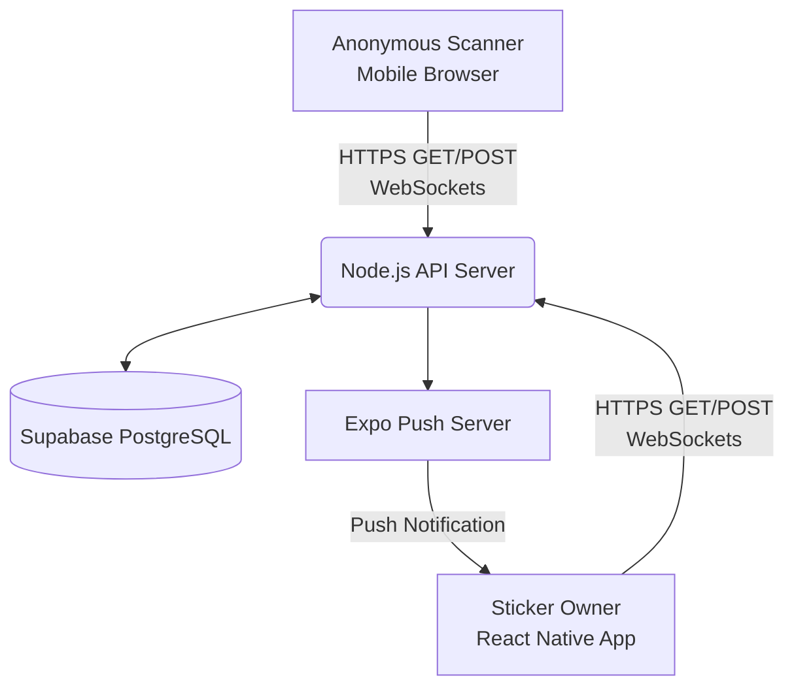
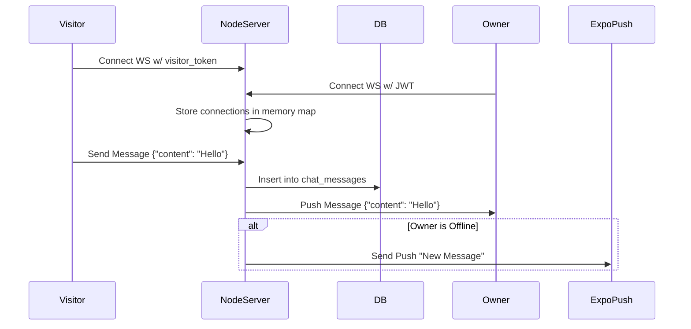

# LinkNPark - Software Architecture & Developer Onboarding

## 1. Executive Summary
### Project Overview
LinkNPark is a smart QR-based sticker application designed to facilitate secure, anonymous communication between individuals and property owners. When a person scans a LinkNPark QR sticker attached to a vehicle, pet, or property (like a doorbell), they can securely notify the owner without either party revealing their phone number.

### Business Purpose
To eliminate the privacy risks associated with leaving personal phone numbers on dashboards, pet collars, or public tags, while still allowing critical, time-sensitive communication (e.g., "Your car is blocking my driveway", "I found your lost dog").

### Target Users
*   **Sticker Owners (Registered Users):** Vehicle owners, pet owners, and property owners who purchase and activate a LinkNPark QR sticker.
*   **Visitors (Anonymous Scanners):** Anyone who encounters a sticker and scans it using their smartphone camera.

### Core Features
*   **Universal QR Scanning:** Fast, app-less scanning via a mobile-optimized web landing page.
*   **Real-Time Anonymous Chat (Car Connect):** WebSockets power instant, WhatsApp-style messaging between the anonymous scanner and the owner.
*   **Secure Push Notifications:** Owners receive Expo push notifications immediately when an incident is reported, even if the app is closed.
*   **Guardian Network:** Allows trusted family/friends to receive alerts if the primary owner is unreachable.
*   **Parking Timer:** Helps owners track parking expiration and receive automated reminders.
*   **Sticker Management & Marketplace:** In-app store to purchase new stickers and manage active tags.

### Key Value Proposition
Privacy-first communication. Instant delivery. No app required for scanners.

### Current Development Status
Production-ready MVP. The core incident reporting, WebSocket chat, push notifications, and marketplace flows are fully functional.

---

## 2. System Architecture Overview

LinkNPark uses a decoupled client-server architecture with a hybrid mobile app for owners, a vanilla web app for scanners, and a Node.js REST/WebSocket API backed by Supabase.

### High-Level Architecture Diagram


### Data Flow Diagram (Incident Reporting)
```mermaid
sequenceDiagram
    participant S as Scanner (Web)
    participant API as API Server
    participant DB as Supabase DB
    participant Push as Expo Push Server
    participant O as Owner (App)

    S->>API: POST /api/report (StickerCode, Reason)
    API->>DB: Insert into 'incidents'
    DB-->>API: Incident ID
    API->>Push: Send Push Notification
    API->>O: Broadcast via WebSocket (if active)
    Push->>O: Wake up device & show alert
    S->>API: POST /api/chat/init (Visitor Token)
    API->>DB: Create 'chat_sessions'
    S<->API: WebSocket Connected
    O<->API: WebSocket Connected (via Push tap)
```

---

## 3. Technology Stack

### Frontend (Mobile App - Owner)
*   **Framework:** React Native with Expo (SDK 54)
*   **Routing:** Expo Router (File-based navigation)
*   **Styling:** Vanilla React Native `StyleSheet` (no Tailwind)
*   **State Management:** React Context (`useAuth`, `useApi`) + Local Component State
*   **Mapping:** `react-native-maps`
*   **Push Notifications:** `expo-notifications`

### Frontend (Web App - Scanner)
*   **Framework:** Vanilla HTML5, CSS3, JavaScript (Zero-dependency for ultra-fast loading on poor cellular networks).
*   **Styling:** TailwindCSS via CDN (for rapid styling).
*   **Hosting:** Hosted as a static site (e.g., Vercel, Cloudflare Pages).

### Backend (API Server)
*   **Runtime:** Node.js
*   **Framework:** Express.js (REST APIs)
*   **Real-Time:** `ws` (Native WebSockets)
*   **Authentication:** Supabase Auth (JWT validation)
*   **Email/SMS:** Resend API

### Database
*   **Type:** PostgreSQL (Hosted on Supabase)
*   **ORM/Query Builder:** `@supabase/supabase-js`

---

## 4. Complete Folder Structure Analysis

```text
StickerOS Code/
├── api-server/                 # Backend Node.js Server
│   ├── server.js               # Main Express app, REST endpoints, and Push logic
│   ├── chat.js                 # WebSocket server implementation & connection manager
│   ├── chat_migration.sql      # Supabase DB schema for chat tables
│   ├── package.json            # Backend dependencies
│   └── .env.development        # Backend environment secrets
├── app/                        # Expo Router Native Frontend
│   ├── (auth)/                 # Authentication screens (Login/OTP)
│   ├── (tabs)/                 # Bottom tab navigation (Incidents, Stickers, Store, etc.)
│   ├── chat/                   # React Native Real-Time Chat screens
│   ├── incident/               # Incident detail screens
│   ├── sticker/                # Sticker detail and management screens
│   ├── _layout.tsx             # Root layout and global providers
│   └── parking-timer.tsx       # Parking timer feature
├── components/                 # Reusable UI Components
│   ├── ui.tsx                  # Core design system (Buttons, Cards, Inputs, Badges)
│   ├── IncidentIcon.tsx        # SVG icons for various incident types
│   └── MarketingBanner.tsx     # Promotional banners for the store
├── constants/                  # App Constants
│   ├── Colors.ts               # Global color palette and theme tokens
│   └── Products.ts             # Static product catalog for the marketplace
├── hooks/                      # Custom React Hooks
│   ├── useApi.ts               # Data fetching logic (Incidents, Stickers)
│   ├── useAuth.ts              # Authentication state management
│   └── usePushToken.ts         # Expo Push Token registration lifecycle
├── scanner-landing/            # Web App for anonymous scanners
│   └── index.html              # Vanilla HTML/JS landing page, reporting UI, and Web Chat
└── eas.json                    # Expo Application Services build configuration
```

---

## 5. API Documentation

### REST Endpoints (`api-server/server.js`)

#### `GET /api/sticker/:code`
*   **Purpose:** Fetches basic public info about a sticker when a scanner loads the landing page.
*   **Response:** `{ found: true, vehicleMake: "Toyota", platePartial: "MH ██ 1234", ownerReachable: true }`

#### `POST /api/auth/request-otp`
*   **Purpose:** Initiates passwordless login for an owner.
*   **Payload:** `{ phone: "1234567890" }`

#### `POST /api/auth/verify-otp`
*   **Purpose:** Verifies OTP and returns a JWT session.
*   **Payload:** `{ phone: "1234567890", token: "123456" }`
*   **Response:** `{ session: { access_token: "jwt...", user: {...} } }`

#### `POST /api/report`
*   **Purpose:** Submits a new incident report from the anonymous scanner.
*   **Payload:** `{ stickerCode: "DECA8A", reason: "blocking", message: "Move your car" }`
*   **Logic:** Inserts into `incidents` table, increments sticker scan count, fires Expo Push Notification to owner, and broadcasts a WebSocket alert.

#### `POST /api/chat/init`
*   **Purpose:** Initializes a secure chat session for an incident.
*   **Payload:** `{ incident_id: "uuid", visitor_token: "random-hash" }`
*   **Logic:** Upserts a record in `chat_sessions` binding the incident to the anonymous visitor.

---

## 6. Database Documentation (Supabase PostgreSQL)

### `stickers`
*   **Purpose:** Represents physical QR stickers.
*   **Fields:** `id` (UUID), `code` (String, Unique 6-char hash), `owner_id` (UUID), `status` (Enum: active/paused), `vehicle_type`, `registration`.

### `incidents`
*   **Purpose:** Logs every scan/report event.
*   **Fields:** `id` (UUID), `sticker_code` (FK), `reason` (String), `status` (Enum: open/resolved/dismissed), `reported_at` (Timestamp).

### `chat_sessions`
*   **Purpose:** Manages the lifecycle of a real-time chat.
*   **Fields:** `id` (UUID), `incident_id` (FK), `visitor_token` (String, Indexed), `status` (Enum: active/closed).

### `chat_messages`
*   **Purpose:** Stores individual chat bubbles.
*   **Fields:** `id` (UUID), `session_id` (FK), `sender_type` (Enum: owner/visitor), `content` (Text), `created_at` (Timestamp).

### `user_push_tokens`
*   **Purpose:** Maps an owner's account to their physical device for Push Notifications.
*   **Fields:** `email` (String, PK), `token` (String, ExpoPushToken).

---

## 7. Authentication & Security

### Owner Authentication
1. User enters phone number on mobile app.
2. App calls `POST /api/auth/request-otp`. Supabase sends OTP via SMS.
3. User enters OTP. App calls `POST /api/auth/verify-otp`.
4. API validates with Supabase Auth and returns a JWT.
5. App stores JWT in `expo-secure-store` (Encrypted Keystore/Keychain).
6. Every subsequent request to protected routes includes `Authorization: Bearer <JWT>`.

### Scanner Authentication (Anonymous)
1. Scanners do not log in.
2. A random `visitor_token` (e.g., `a7x9p2`) is generated and stored in `localStorage`.
3. This token acts as a stateless session ID, allowing them to reconnect to their specific chat session if they refresh the page, without ever revealing their identity to the owner.

### Security Best Practices Implemented
*   **Row Level Security (RLS):** Supabase database tables are locked down. The API server uses a `SERVICE_ROLE_KEY` to bypass RLS, acting as the sole gatekeeper.
*   **No PII Leakage:** The scanner UI only receives a masked license plate (`MH ██ 1234`). The owner never sees the scanner's IP or data unless explicitly provided.

---

## 8. Frontend Architecture (React Native)

The app utilizes Expo Router for file-based routing, mimicking Next.js.

### Navigation Flow
*   `app/_layout.tsx` - App entry point. Checks auth state.
*   `app/(auth)/` - Login screens (unauthenticated users).
*   `app/(tabs)/` - Main dashboard (authenticated users).
    *   `index.tsx` (Home/Dashboard)
    *   `incidents.tsx` (Inbox/Alerts)
    *   `stickers.tsx` (My Tags)
    *   `marketplace.tsx` (Store)

### Component Design System
Located in `components/ui.tsx`. All UI relies on custom wrapped components (`<Button>`, `<Card>`, `<Badge>`, `<Input>`) rather than raw React Native primitives to ensure design consistency and easy global theme updates via `constants/Colors.ts`.

---

## 9. Real-Time Chat (WebSockets) Deep Dive

To prevent battery drain and ensure instant delivery, Chat uses WebSockets instead of HTTP polling.

### Flow Diagram


### Connection Management
*   Connections are mapped in `api-server/chat.js` using `activeConnections = Map<SessionID, { owner: WebSocket, visitor: WebSocket }>`.
*   If a message is sent and the target role's socket is missing from the Map, the server gracefully falls back to sending an Expo Push Notification to wake up their device.

---

## 10. Deployment & Infrastructure Architecture

### Current Setup
*   **Database:** Supabase (Cloud Postgres).
*   **Mobile App:** Built via Expo Application Services (EAS). `eas build -p android --profile production`.
*   **API Server:** Must be hosted on a persistent Node.js environment (e.g., Railway, Render, DigitalOcean, Heroku) because WebSockets require long-lived connections (Serverless functions like Vercel do NOT support native WebSockets).
*   **Web Scanner:** Can be hosted on any static CDN (Vercel, GitHub Pages) as it is just an `index.html` file.

### Environment Variables
*   `SUPABASE_URL`: DB Endpoint
*   `SUPABASE_SERVICE_KEY`: Admin DB bypass key (Server only)
*   `JWT_SECRET`: Used to verify owner tokens
*   `PORT`: API port (Default 3001)

---

## 11. Developer Onboarding Guide

### Prerequisites
*   Node.js (v18+)
*   Expo CLI (`npm install -g expo-cli`)
*   Supabase Account
*   Expo Go app (on your physical iOS/Android device)

### Running Locally
1. **Database:** Ensure your Supabase instance is running and you have run `api-server/chat_migration.sql` in the SQL editor.
2. **Backend API:**
   ```bash
   cd api-server
   npm install
   # Create a .env.development file with your Supabase keys
   npm run dev
   ```
   *The server should print `LinkNPark API server running at http://0.0.0.0:3001`.*
3. **Mobile App:**
   ```bash
   # In the root StickerOS Code folder
   npm install
   npx expo start
   ```
   *Scan the QR code with Expo Go on your phone.*
4. **Web Scanner:**
   Use the VS Code "Live Server" extension to serve `scanner-landing/index.html`. Add `?code=YOUR_STICKER_CODE` to the URL to test scanning.

### Critical Things to Remember
*   **WebSockets vs Serverless:** Do not attempt to deploy `api-server` to Vercel/Netlify Functions. WebSockets will fail. Use Railway or Render.
*   **Scanner Performance:** The `scanner-landing/index.html` file is intentionally vanilla JavaScript and Tailwind CDN. Do not convert this to a heavy React/Next.js app. Scanners are often in parking lots with 1 bar of 3G signal; the landing page must load instantly.

---

## 12. Future Enhancements & Tech Debt

1. **Redis Pub/Sub:** Currently, WebSocket connections are held in application memory (`Map()`). If you scale the Node.js API server to multiple instances (horizontal scaling), a visitor connected to Server A cannot chat with an owner connected to Server B. **Action:** Implement Redis Pub/Sub to broadcast WebSocket messages across multiple Node instances.
2. **Media Support:** Chat currently only supports text. Integrate AWS S3 or Supabase Storage to allow visitors to send photos of the incident.
3. **Automated Testing:** Implement Jest for API unit tests and Detox for React Native end-to-end testing. Currently, manual testing is the only validation method.
4. **Offline Sync:** Implement WatermelonDB or SQLite in the React Native app to cache incidents so the app loads instantly even with poor cell service.

---
*Document Version: 1.0.0*
*Last Updated: Automatically Generated by Agentic AI*
