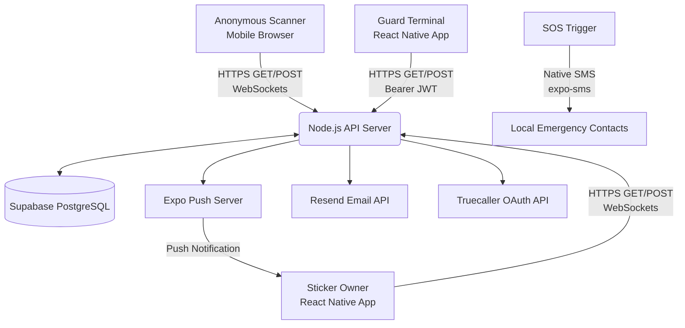

# LinkNPark — Software Architecture & Developer Onboarding

> **Document Version:** 2.0.0
> **Last Updated:** 2026-06-18
> **Maintained by:** Multi-Agent Team (CEO · Industry Researcher · Full Stack Dev · QA Lead · Code Reviewer)

---

## 1. Executive Summary

### Project Overview
LinkNPark is a smart QR-based sticker application designed to facilitate secure, anonymous communication between individuals and property/vehicle owners. When a person scans a LinkNPark QR sticker attached to a vehicle, pet, or property (like a doorbell), they can securely notify the owner without either party revealing their phone number.

### Business Purpose
To eliminate the privacy risks associated with leaving personal phone numbers on dashboards, pet collars, or public tags, while still allowing critical, time-sensitive communication (e.g., "Your car is blocking my driveway", "I found your lost dog").

### Target Users
- **Sticker Owners (Registered Users):** Vehicle owners, pet owners, and property owners who purchase and activate a LinkNPark QR sticker.
- **Visitors (Anonymous Scanners):** Anyone who encounters a sticker and scans it using their smartphone camera.
- **Security Personnel (Guard Mode Users):** Guards at gated communities, parking lots, or commercial properties who use the Guard Terminal feature.

### Core Features
| Feature | Status | Description |
|---|---|---|
| Universal QR Scanning | ✅ Live | App-less scanning via mobile-optimized web landing page |
| Real-Time Anonymous Chat | ✅ Live | WebSocket-powered messaging between scanner and owner |
| Incident Reporting | ✅ Live | Scanner reports issues (blocking, lights on, etc.) |
| Expo Push Notifications | ✅ Live | Owner woken up even when app is closed |
| Guardian Network (Zones) | ✅ Live | Community zone-based alert system |
| Guard Mode (Terminal) | ✅ Live | Security personnel interface for gated communities |
| SOS Emergency Alert | ✅ Live | Device-native SMS to local emergency contacts |
| Emergency Contacts | ✅ Live | Local on-device contact list for SOS |
| Parking Timer | ✅ Live | Tracks parking expiry with automated reminders |
| Sticker Marketplace | ✅ Live (No payment backend) | In-app store UI; Razorpay integration planned |
| Safety Radar | 🔧 UI Mockup | Heatmap visualization (not wired to live data yet) |
| Truecaller Auth | ✅ Live | One-tap phone number verification via Truecaller OAuth |
| Admin Sticker Management | ✅ Live | Backend-only ADMIN_KEY-gated sticker lifecycle API |

### Key Value Proposition
Privacy-first communication. Instant delivery. No app required for scanners.

### Payment / Billing Status
> ⚠️ The marketplace UI exists but there is **no backend payment infrastructure** today. Razorpay integration is planned for the production launch. All marketplace purchases are currently conceptual or handled externally.

---

## 2. System Architecture Overview

LinkNPark uses a decoupled client-server architecture with a hybrid mobile app for owners, a vanilla web app for scanners, and a Node.js REST/WebSocket API backed by Supabase.

### High-Level Architecture Diagram


### Data Flow Diagram (Incident Reporting)
```mermaid
sequenceDiagram
    participant S as Scanner (Web)
    participant API as API Server
    participant DB as Supabase DB
    participant Push as Expo Push Server
    participant O as Owner (App)

    S->>API: POST /api/report (StickerCode, Reason)
    API->>DB: Insert into 'incidents'
    DB-->>API: Incident ID
    API->>Push: Send Push Notification
    API->>O: Broadcast via WebSocket (if active)
    Push->>O: Wake up device & show alert
    S->>API: POST /api/chat/init (Visitor Token)
    API->>DB: Create 'chat_sessions'
    S<->API: WebSocket Connected
    O<->API: WebSocket Connected (via Push tap)
```

---

## 3. Technology Stack

### Frontend (Mobile App — Owner & Guard)
- **Framework:** React Native with Expo (SDK 54)
- **Routing:** Expo Router (File-based navigation, mirrors Next.js conventions)
- **Styling:** Vanilla React Native `StyleSheet` (no Tailwind)
- **State Management:** React Context (`useAuth`, `useApi`) + Local Component State
- **Mapping:** `react-native-maps`
- **Push Notifications:** `expo-notifications`
- **Secure Storage:** `expo-secure-store` (JWT, Emergency Contacts)
- **SMS:** `expo-sms` (SOS feature)
- **Location:** `expo-location` (SOS GPS tagging)

### Frontend (Web App — Scanner)
- **Framework:** Vanilla HTML5, CSS3, JavaScript (Zero-dependency for ultra-fast loading on poor cellular networks)
- **Styling:** TailwindCSS via CDN (for rapid styling)
- **Hosting:** Hosted as a static site (Vercel, Cloudflare Pages, etc.)

### Backend (API Server)
- **Runtime:** Node.js
- **Framework:** Express.js (REST APIs)
- **Real-Time:** `ws` (Native WebSockets)
- **Authentication:** Custom JWT (via `jsonwebtoken` library)
- **Email OTP:** Resend API
- **Third-Party Auth:** Truecaller OAuth 2.0 (PKCE flow)

### Database
- **Type:** PostgreSQL (Hosted on Supabase)
- **ORM/Query Builder:** `@supabase/supabase-js` (v2)
- **Access Pattern:** All DB access via the Node.js backend using the `SUPABASE_SERVICE_KEY` which bypasses Row Level Security (RLS).

---

## 4. Complete Folder Structure

```text
LinkNPark (StickerOS Code)/
├── api-server/                   # Backend Node.js Server
│   ├── server.js                 # Main Express app (814 lines) — all REST endpoints
│   ├── chat.js                   # WebSocket server — bidirectional chat connection manager
│   ├── chat_migration.sql        # Supabase DB schema: chat_sessions, chat_messages
│   ├── package.json              # Backend dependencies (express, ws, jsonwebtoken, etc.)
│   └── .env.development          # Backend environment secrets (gitignored)
├── app/                          # Expo Router Native Frontend
│   ├── (auth)/                   # Authentication screens (Login, OTP entry)
│   ├── (tabs)/                   # Bottom tab navigation (Home, Incidents, Stickers, Store)
│   ├── chat/                     # React Native Real-Time Chat screen (owner side)
│   ├── incident/                 # Incident detail screens
│   ├── sticker/                  # Sticker detail and management screens
│   ├── marketplace/              # Marketplace / Store screens
│   ├── product/                  # Individual product detail screens
│   ├── checkout/                 # Checkout flow (UI only, no backend payment)
│   ├── _layout.tsx               # Root layout — auth guard and global providers
│   ├── activate.tsx              # Sticker activation wizard
│   ├── parking-timer.tsx         # Parking timer feature (alerts for expiry)
│   ├── guardian-network.tsx      # Guardian Network — zone browsing and join/leave UI
│   ├── guard.tsx                 # Guard Mode Terminal (security personnel interface)
│   ├── safety-radar.tsx          # Safety Radar — heatmap visualization (UI mockup, not live)
│   ├── sos-settings.tsx          # SOS configuration and trigger screen
│   ├── emergency-contacts.tsx    # Local emergency contact list management
│   ├── notification-preferences.tsx  # Push notification settings
│   ├── edit-profile.tsx          # User profile editor
│   └── scan.tsx                  # In-app QR code scanner (for owner to scan a sticker)
├── components/                   # Reusable UI Components
│   ├── ui.tsx                    # Core design system (Button, Card, Input, Badge)
│   ├── IncidentIcon.tsx          # SVG icons for incident types
│   ├── MarketingBanner.tsx       # Promotional banners for the store
│   ├── ReportBanner.tsx          # Report confirmation banner component
│   ├── VehicleIcon.tsx           # Vehicle type SVG icons
│   ├── ParkingMap.tsx            # React Native map wrapper (native)
│   └── ParkingMap.web.tsx        # React Native map wrapper (web fallback)
├── constants/                    # App Constants
│   ├── Colors.ts                 # Global color palette and theme tokens
│   └── Products.ts               # Static product catalog for the marketplace
├── hooks/                        # Custom React Hooks
│   ├── useApi.ts                 # Data fetching (Incidents, Stickers) with caching
│   ├── useAuth.ts                # Auth state, JWT storage, login/logout logic
│   └── usePushNotifications.ts   # Expo Push Token registration + API_BASE constant
├── scanner-landing/              # Web App for anonymous scanners
│   └── index.html                # Vanilla HTML/JS: sticker info, incident reporting, web chat
├── assets/                       # App icons, splash screens, fonts
├── App.tsx                       # Root component entry
├── app.config.ts                 # Expo app configuration (bundle ID, permissions, plugins)
├── eas.json                      # Expo Application Services build profiles
└── package.json                  # Mobile app dependencies
```

---

## 5. API Documentation

All endpoints are on the API server. Base URL: `https://api.linknpark.in` (or `http://localhost:3001` locally).

### Authentication Endpoints

#### `POST /api/auth/send-otp`
- **Auth:** None
- **Purpose:** Sends a 6-digit OTP to the provided email via Resend.
- **Payload:** `{ email: "user@example.com" }`
- **Notes:** OTP stored in process memory (`Map`) with 5-minute TTL and 5-attempt lockout.

#### `POST /api/auth/verify-otp`
- **Auth:** None
- **Purpose:** Validates OTP and issues a 90-day JWT.
- **Payload:** `{ email: "user@example.com", code: "123456" }`
- **Response:** `{ ok: true, token: "jwt...", user: { email: "..." } }`

#### `POST /api/auth/truecaller`
- **Auth:** None
- **Purpose:** Exchanges a Truecaller PKCE authorization code for a LinkNPark JWT.
- **Payload:** `{ authorizationCode: "...", codeVerifier: "..." }`
- **Notes:** Truecaller returns a `phone_number` which is stored in the JWT's `email` field for identity consistency. This is a known field-overloading pattern — the `email` JWT field may contain a phone number if user authenticated via Truecaller.

#### `GET /api/auth/me`
- **Auth:** Bearer JWT
- **Purpose:** Returns the decoded JWT payload (user identity check).

#### `POST /api/auth/update`
- **Auth:** Bearer JWT
- **Purpose:** Updates the user's display name by re-issuing a new JWT with updated claims.

---

### Sticker Endpoints (Authenticated)

#### `GET /api/stickers`
- **Auth:** Bearer JWT
- **Purpose:** Returns all stickers owned by the authenticated user.

#### `POST /api/stickers`
- **Auth:** Bearer JWT
- **Purpose:** Claims/activates a pre-registered sticker code. The code must already exist in the DB (pre-registered by Admin). Returns 400 if code is unrecognized or 409 if already claimed.
- **Payload:** `{ code, vehicle_type, registration, vehicle_name?, color?, backup_phone?, tag_type?, tag_title? }`

#### `PATCH /api/stickers/:id`
- **Auth:** Bearer JWT
- **Purpose:** Updates a sticker's details. Owner-scoped (enforced by `owner_email` check).

#### `DELETE /api/stickers/:id`
- **Auth:** Bearer JWT
- **Purpose:** Removes a sticker from the owner's account.

---

### Incident Endpoints (Authenticated)

#### `GET /api/incidents`
- **Auth:** Bearer JWT
- **Purpose:** Returns all incidents across all of the owner's stickers, with vehicle join.

#### `PATCH /api/incidents/:id`
- **Auth:** Bearer JWT
- **Purpose:** Updates incident status to `open`, `resolved`, or `dismissed`. Sets `resolved_at` timestamp on resolution.

---

### Public Scanner Endpoints (No Auth)

#### `GET /api/sticker/:code`
- **Auth:** None (public)
- **Purpose:** Returns safe public info when a scanner loads the landing page.
- **Response:** `{ found: true, vehicleType, vehicleColor, vehicleMake, platePartial: "MH ██ 34", tagType, tagTitle, ownerReachable: true }`
- **Privacy:** Plate is always partially masked. Raw PII (owner email, full plate) is never returned.

#### `POST /api/report`
- **Auth:** None (public)
- **Purpose:** Submits an incident report. Triggers push notification + WebSocket broadcast.
- **Payload:** `{ stickerCode, reason, message?, reporterPhone? }`
- **Valid Reasons:** `blocking`, `lights`, `accident`, `suspect`, `theft`, `other`, `wrong_parking`, `emergency`

---

### Push Notification Endpoints

#### `POST /api/push-token`
- **Auth:** Bearer JWT
- **Purpose:** Registers or updates the owner's Expo Push Token. Uses upsert on `email`.

---

### Real-Time Chat Endpoints

#### `POST /api/chat/init`
- **Auth:** None
- **Purpose:** Initializes or retrieves a chat session bound to an incident and visitor token.
- **Payload:** `{ incident_id, visitor_token }`

#### `GET /api/chat/:sessionId/messages`
- **Auth:** None
- **Purpose:** Fetches all messages for a chat session (for scanner-side chat history).

#### `GET /api/incidents/:id/chat`
- **Auth:** Bearer JWT
- **Purpose:** Owner fetches the active chat session for a given incident.

---

### Guardian Network Endpoints (Authenticated)

#### `GET /api/guardians/zones`
- **Auth:** Bearer JWT
- **Purpose:** Returns all zones with a boolean `active` flag indicating whether the user has joined each zone.

#### `POST /api/guardians/zones`
- **Auth:** Bearer JWT
- **Purpose:** Creates a new community zone. Creator is auto-joined.
- **Payload:** `{ name: "Zone Name", zone: "Area Description" }`

#### `POST /api/guardians/join`
- **Auth:** Bearer JWT
- **Purpose:** Joins or leaves a zone.
- **Payload:** `{ zoneId: "uuid", active: true | false }`

---

### Guard Mode Endpoints (Authenticated)

#### `GET /api/guard/vehicle?query=<plate_or_code>`
- **Auth:** Bearer JWT
- **Purpose:** Looks up a vehicle by license plate number or sticker code for the Guard Terminal.
- **Response:** `{ vehicle: { code, plate, color, type, resident, flat, tower, incidents } }`
- **Notes:** `flat` and `tower` fields currently return `'N/A'` — these require a future schema addition to the `stickers` table.

---

### Admin Sticker Management Endpoints

All admin endpoints require the `x-admin-key` header or `admin_key` query parameter matching the `ADMIN_KEY` environment variable.

> ⚠️ These endpoints are not user-facing. They are operational tools for the LinkNPark team.

#### `GET /api/admin/stickers`
- Query params: `code`, `prefix`, `status`, `limit`
- Returns matching stickers from the registry.

#### `PATCH /api/admin/stickers/:code`
- Updates a single sticker's fields.

#### `POST /api/admin/stickers/bulk-status`
- Bulk-updates sticker status. Supports `codes[]`, `from_code+to_code` range, or `prefix`.

#### `POST /api/admin/stickers/pre-register`
- Inserts new unclaimed sticker codes into the database before physical stickers are printed/shipped.
- **Payload:** `{ codes: ["CODE1", "CODE2", ...] }`

#### `GET /api/admin/debug-db` *(Unprotected — see Security Notes)*
- Returns Supabase connectivity info and a test JWT.

---

## 6. Database Schema (Supabase PostgreSQL)

### `stickers`
Represents physical QR stickers, both claimed and unclaimed.

| Column | Type | Notes |
|---|---|---|
| `id` | UUID (PK) | Auto-generated |
| `code` | String (Unique) | 6-char uppercase hash |
| `owner_email` | String | FK to user identity. `'unclaimed@linknpark.in'` if pre-registered but not yet claimed |
| `status` | Enum | `unclaimed`, `active`, `paused`, `inactive`, `lost` |
| `vehicle_type` | String | e.g., `car`, `bike`, `pet`, `property` |
| `vehicle_name` | String | Display name (e.g., "Toyota Fortuner") |
| `registration` | String | License plate or identifier |
| `color` | String | Vehicle/tag color |
| `backup_phone` | String | Optional secondary contact number |
| `tag_type` | String | `vehicle`, `pet`, `property` — controls scanner page UI |
| `tag_title` | String | Custom title for non-vehicle tags |
| `scan_count` | Integer | Total scan events |
| `last_scanned_at` | Timestamp | Last scan timestamp |
| `created_at` | Timestamp | Record creation time |

### `incidents`
Logs every scan/report event.

| Column | Type | Notes |
|---|---|---|
| `id` | UUID (PK) | Auto-generated |
| `sticker_code` | String (FK) | References `stickers.code` |
| `reason` | String | Machine key (e.g., `blocking`) |
| `reason_label` | String | Human label (e.g., "Blocking driveway") |
| `message` | Text | Optional free-text from scanner |
| `reporter_phone` | String | Optional, scanner-provided |
| `status` | Enum | `open`, `resolved`, `dismissed` |
| `reported_at` | Timestamp | Auto-set on insert |
| `resolved_at` | Timestamp | Set when status moves to resolved/dismissed |

### `chat_sessions`
Manages the lifecycle of a real-time chat.

| Column | Type | Notes |
|---|---|---|
| `id` | UUID (PK) | Auto-generated |
| `incident_id` | UUID (FK) | References `incidents.id` (CASCADE DELETE) |
| `visitor_token` | String (Indexed) | Random hash stored in scanner's `localStorage` |
| `status` | Enum | `active`, `closed` |
| `created_at` | Timestamp | Session start time |

### `chat_messages`
Stores individual chat messages.

| Column | Type | Notes |
|---|---|---|
| `id` | UUID (PK) | Auto-generated |
| `session_id` | UUID (FK) | References `chat_sessions.id` (CASCADE DELETE) |
| `sender_type` | Enum | `owner`, `visitor` |
| `content` | Text | Message body |
| `created_at` | Timestamp | Message timestamp |

### `user_push_tokens`
Maps an owner's account to their physical device.

| Column | Type | Notes |
|---|---|---|
| `email` | String (PK) | Owner's email (or Truecaller phone number) |
| `token` | String | Expo Push Token (`ExponentPushToken[...]`) |
| `updated_at` | Timestamp | Last token refresh |

### `zones` *(Guardian Network)*
Community zones for the Guardian Network feature.

| Column | Type | Notes |
|---|---|---|
| `id` | UUID (PK) | Auto-generated |
| `name` | String | Zone display name (e.g., "Sunrise Apartments Block A") |
| `area` | String | Geographic/textual description of the zone |

### `zone_members` *(Guardian Network)*
Join table linking users to zones.

| Column | Type | Notes |
|---|---|---|
| `zone_id` | UUID (FK) | References `zones.id` |
| `user_email` | String | Owner's email |
| *(Unique constraint)* | | `(zone_id, user_email)` — prevents duplicate memberships |

---

## 7. Authentication & Security

### Owner Authentication Flow
1. User enters email on mobile app.
2. App calls `POST /api/auth/send-otp`. Server generates OTP, stores in in-memory `Map`, sends via Resend.
3. User enters OTP. App calls `POST /api/auth/verify-otp`.
4. Server validates OTP (5-attempt lockout, 5-minute TTL), issues a **90-day JWT** signed with `JWT_SECRET`.
5. App stores JWT in `expo-secure-store` (Encrypted Keystore/Keychain).
6. Every subsequent request to protected routes includes `Authorization: Bearer <JWT>`.

### Truecaller Authentication Flow (Alternative)
1. App initiates Truecaller PKCE OAuth flow (one-tap phone verification).
2. On success, app receives `authorizationCode` and `codeVerifier`.
3. App calls `POST /api/auth/truecaller`, which exchanges the code for a Truecaller access token, fetches the user's phone number, and issues a LinkNPark JWT with `phone_number` stored in the `email` JWT field.

### Scanner Authentication (Anonymous)
1. Scanners do not log in.
2. A random `visitor_token` (UUID-style) is generated on page load and stored in `localStorage`.
3. This token acts as a stateless session ID, allowing reconnection to a specific chat if the page is refreshed.

### SOS Emergency Contacts (Local)
1. Emergency contacts are stored **only on-device** in `expo-secure-store` under key `emergency_contacts_v1`.
2. These contacts are **never uploaded to the server**.
3. SOS directly invokes the device's native SMS capability via `expo-sms`.

### Security Practices
- **Row Level Security (RLS):** Enabled on `chat_sessions` and `chat_messages`. All DB access via `SUPABASE_SERVICE_KEY` bypasses RLS.
- **No PII Leakage:** Scanner receives only masked plate. Owner never sees scanner IP or identity.
- **OTP Lockout:** 5 failed attempts delete the OTP entry, forcing a re-request.
- **Admin Isolation:** Admin endpoints are gated by `ADMIN_KEY` (separate from user JWTs).

### Known Security Issues (Backlog)
| Issue | Severity | Status |
|---|---|---|
| No rate limiting on `POST /api/auth/send-otp` | High | ✅ Fixed — `express-rate-limit` (10 req/hr/IP) |
| `GET /api/admin/debug-db` was unauthenticated | Critical | ✅ Fixed — gated by `requireAdmin`, no longer issues JWTs |
| CORS was fully open (`cors()`) | Medium | ✅ Fixed — origin whitelist via `ALLOWED_ORIGINS` env var |
| JWT_SECRET had insecure hardcoded fallback | High | ✅ Fixed — startup crash-guard (`process.exit(1)` in production) |
| ADMIN_KEY had insecure hardcoded fallback | High | ✅ Fixed — same startup crash-guard |
| In-memory OTP store lost on restart | Medium | ⏳ Open — move to Supabase `otps` table |

---

## 8. Feature Deep Dives

### 8.1 Guard Mode (Terminal)
**File:** `app/guard.tsx` (568 lines)
**API:** `GET /api/guard/vehicle?query=<plate_or_code>`

The Guard Mode is a dedicated dark-themed interface for security personnel at gated communities or commercial parking lots. It allows a guard to:
1. Enter a vehicle's license plate or scan a sticker code.
2. Look up the resident's public details (vehicle type, color, registration, resident name).
3. Trigger a targeted push notification to the vehicle owner with predefined incident types: **Blocking Exit, Wrong Parking, Security Concern, Lights On, Visitor Entry, General Alert**.

The Guard authenticates using the same JWT system as regular users. The guard's account must be a registered LinkNPark user. The `flat` and `tower` fields in the response are currently `'N/A'` pending a schema enhancement.

### 8.2 Guardian Network (Zones)
**File:** `app/guardian-network.tsx`
**API:** `/api/guardians/*`
**DB Tables:** `zones`, `zone_members`

A community-based alert zone system. Users can:
- Browse all existing zones and see which they've joined.
- Create a new zone (they are auto-joined as a member).
- Toggle membership by joining or leaving zones.

The intended future use is: when an incident is reported in a zone's area, all zone members receive an alert. This broadcast logic **is not yet implemented** in the backend.

### 8.3 SOS Emergency Alert
**File:** `app/sos-settings.tsx`
**Dependencies:** `expo-sms`, `expo-location`, `expo-secure-store`

A fully local, offline-capable emergency feature. When triggered:
1. Fetches GPS coordinates via `expo-location`.
2. Constructs an SMS with a Google Maps link.
3. Sends via `expo-sms` (native SMS sheet) or falls back to `sms:` deep link.
4. Recipients are the emergency contacts stored locally.

**No server communication occurs.** This is intentional to ensure the SOS works even without internet.

### 8.4 Emergency Contacts
**File:** `app/emergency-contacts.tsx`
**Storage:** `expo-secure-store` key: `emergency_contacts_v1`

A simple CRUD interface for managing local emergency contacts (name, phone, relation). These contacts are used exclusively by the SOS feature. They are never synced to the server.

### 8.5 Safety Radar
**File:** `app/safety-radar.tsx`
**Status:** UI Mockup Only

Displays a visualization concept for a city-wide incident heatmap. Currently renders hardcoded mock data points (Safe/Warning/High Risk) over a map. Not wired to any live backend endpoint. Future implementation will query aggregated, anonymized incident data from the database.

### 8.6 Admin Sticker Management
**File:** `api-server/server.js` (lines 617–730)
**Auth:** `x-admin-key` header (operational tool, not user-facing)

The full sticker lifecycle management API:
1. `pre-register` — inserts batch sticker codes as `unclaimed` before physical printing.
2. `GET /api/admin/stickers` — query registry by code, prefix, or status.
3. `PATCH /api/admin/stickers/:code` — update individual sticker.
4. `bulk-status` — activate/pause/deactivate batches of stickers.

---

## 9. Real-Time Communication (WebSockets)

Two parallel WebSocket systems exist:

### 9.1 Incident Real-Time Alerts (server.js)
Used to push new incident notifications to the owner's mobile app while it is in the foreground.
- Connection: Owner app subscribes with `{ type: 'subscribe', stickerCode: 'ABCD12' }`.
- Server maps `stickerCode → Set<WebSocket>` in `stickerClients` object.
- On new report: `pushToClients(code, payload)` broadcasts to all subscribers.
- If owner is not connected: falls back to Expo Push Notification.

### 9.2 Bidirectional Chat (chat.js)
Used for real-time two-way messaging between scanner (web) and owner (app).
- Connections stored in: `activeConnections = Map<SessionID, { owner: WebSocket, visitor: WebSocket }>`.
- Messages are persisted to `chat_messages` table.
- If target party is offline: falls back to Expo Push Notification.

### WebSocket Scaling Limitation
Both WebSocket systems store connections **in application memory**. Horizontal scaling across multiple Node.js instances is not supported. **Action required before scaling:** Implement Redis Pub/Sub.

---

## 10. Deployment & Infrastructure Architecture

### Current Setup
| Component | Platform | Notes |
|---|---|---|
| Database | Supabase (Cloud Postgres) | Managed, auto-scaled |
| Mobile App | Expo Application Services (EAS) | `eas build -p android --profile production` |
| API Server | Railway / Render / DigitalOcean | Must be persistent (WebSockets require long-lived connections) |
| Web Scanner | Vercel / Cloudflare Pages / GitHub Pages | Static CDN — `scanner-landing/index.html` |

> ⚠️ **DO NOT** deploy `api-server` to Vercel or Netlify Functions. WebSocket connections will fail on serverless platforms.

### Environment Variables (API Server)
| Variable | Required | Description |
|---|---|---|
| `SUPABASE_URL` | ✅ | Supabase project URL |
| `SUPABASE_SERVICE_KEY` | ✅ | Service role key (bypasses RLS) |
| `JWT_SECRET` | ✅ | Signing key for JWTs. **Crash on startup if missing in production.** |
| `RESEND_API_KEY` | ✅ | Resend API key for email OTP |
| `FROM_EMAIL` | Optional | Sender address (default: `LinkNPark <onboarding@resend.dev>`) |
| `ADMIN_KEY` | ✅ | Master key for admin sticker management endpoints |
| `TRUECALLER_CLIENT_ID` | Optional | Truecaller OAuth client ID |
| `PORT` | Optional | API server port (default: 3001) |

---

## 11. Frontend Architecture (React Native)

The app uses Expo Router for file-based routing, mimicking Next.js.

### Navigation Flow
```
app/_layout.tsx          → Root entry. Checks auth state. Guards all routes.
app/(auth)/              → Login screens (unauthenticated).
app/(tabs)/              → Main tabbed dashboard (authenticated).
  └── index.tsx          → Home / Dashboard
  └── incidents.tsx      → Incident Inbox / Alerts
  └── stickers.tsx       → My Tags management
  └── marketplace.tsx    → Store / Marketplace
app/activate.tsx         → Sticker activation wizard
app/chat/                → Owner-side real-time chat screen
app/incident/            → Incident detail view
app/sticker/             → Sticker detail and edit view
app/guardian-network.tsx → Zone management
app/guard.tsx            → Guard Mode Terminal
app/parking-timer.tsx    → Parking timer
app/safety-radar.tsx     → Safety Radar (UI mockup)
app/sos-settings.tsx     → SOS configuration
app/emergency-contacts.tsx → Local contact list
app/notification-preferences.tsx → Push notification settings
app/edit-profile.tsx     → Profile editor
app/scan.tsx             → In-app QR scanner
```

### Component Design System
Located in `components/ui.tsx`. All UI relies on custom wrapped components (`<Button>`, `<Card>`, `<Badge>`, `<Input>`) rather than raw React Native primitives to ensure design consistency and easy global theme updates via `constants/Colors.ts`.

---

## 12. Developer Onboarding

### Prerequisites
- Node.js (v18+)
- Expo CLI (`npm install -g expo-cli`)
- Supabase Account with the schema from `api-server/chat_migration.sql` applied
- Expo Go app on a physical iOS or Android device

### Running Locally

**1. Database:**
Run `api-server/chat_migration.sql` in the Supabase SQL editor to create `chat_sessions` and `chat_messages`. Also create `stickers`, `incidents`, `user_push_tokens`, `zones`, and `zone_members` tables as documented in Section 6.

**2. Backend API:**
```bash
cd api-server
npm install
# Create .env.development with all required environment variables
npm run dev
# → Server running at http://0.0.0.0:3001
```

**3. Mobile App:**
```bash
# From the root StickerOS Code directory
npm install
npx expo start
# Scan the QR with Expo Go
```

**4. Web Scanner:**
Use VS Code "Live Server" extension to serve `scanner-landing/index.html`.
Navigate to `http://localhost:5500/scanner-landing?code=YOUR_STICKER_CODE`.

### Critical Things to Remember
- **WebSockets vs Serverless:** Never deploy `api-server` to Vercel/Netlify Functions.
- **Scanner Performance:** `scanner-landing/index.html` is intentionally vanilla JS. Do not convert to React/Next.js.
- **Truecaller `email` field:** When a user authenticates via Truecaller, their JWT's `email` field contains a phone number. Always treat this field as "primary identity" not strictly as an email address.
- **Pre-registration required:** Sticker codes must be pre-registered via the Admin API before users can activate them in the app.
- **SOS is fully local:** Emergency contacts and SOS SMS bypass the server entirely.

---

## 13. Future Enhancements & Tech Debt

| # | Item | Priority | Notes |
|---|---|---|---|
| 1 | **Redis Pub/Sub for WebSocket scaling** | 🔴 High | Blocking horizontal scaling |
| 2 | **Rate limiting on auth endpoints** | ✅ Done | `express-rate-limit` applied to `/api/auth/send-otp` |
| 3 | **Startup crash-guard for JWT_SECRET / ADMIN_KEY** | ✅ Done | `process.exit(1)` in production if env vars missing |
| 4 | **Remove / secure `GET /api/admin/debug-db`** | ✅ Done | Now gated by `requireAdmin`; no longer issues JWTs |
| 5 | **Lock CORS origins** | ✅ Done | Origin whitelist + `ALLOWED_ORIGINS` env var |
| 6 | **OTP store → Supabase `otps` table** | 🟡 Medium | Survives server restarts |
| 7 | **`server.js` route module split** | 🟡 Medium | Split into `routes/auth.js`, `routes/stickers.js`, etc. |
| 8 | **Photo upload in chat** | 🟡 Medium | AWS S3 or Supabase Storage |
| 9 | **Razorpay payment integration** | 🟡 Medium | For marketplace — planned for launch |
| 10 | **Guardian Network alert broadcasts** | 🟡 Medium | Backend logic to notify zone members of nearby incidents |
| 11 | **Safety Radar live data** | 🟢 Low | Wire to aggregated incident query |
| 12 | **Guard Mode flat/tower fields** | 🟢 Low | Add `flat_no`, `tower` to `stickers` schema |
| 13 | **Jest API test suite** | 🟡 Medium | No automated tests currently exist |
| 14 | **Detox E2E test suite** | 🟢 Low | React Native end-to-end testing |
| 15 | **Offline sync (WatermelonDB/SQLite)** | 🟢 Low | Cache incidents for poor connectivity |
| 16 | **`user_push_tokens` PK migration** | 🟡 Medium | Change PK from `email` to `id` UUID for resilience |

---

*Document Version: 2.0.0*
*Generated and maintained by the LinkNPark Multi-Agent Team*
